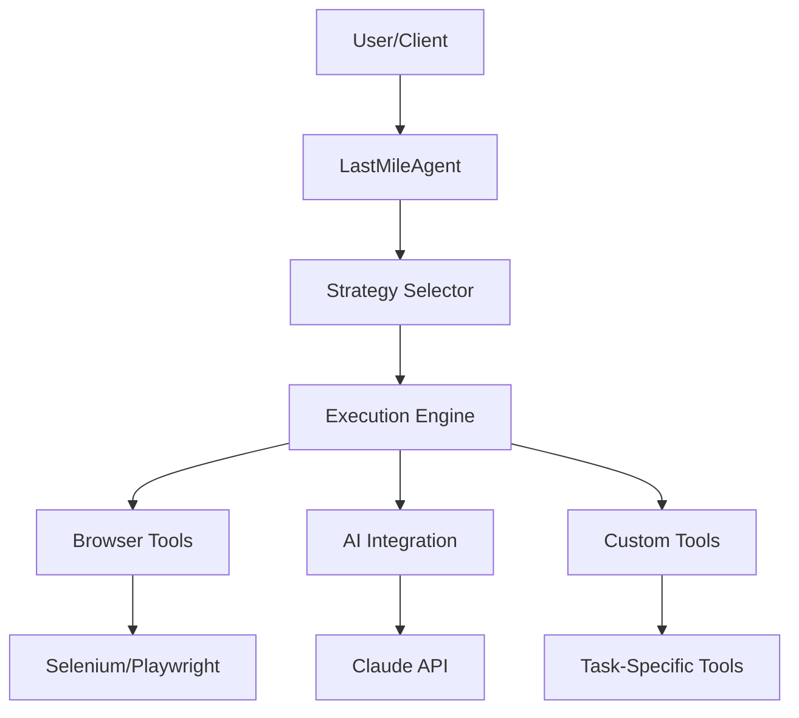

# Arcana Agent Framework Architecture

## System Overview

## Core Components

### LastMileAgent
The central orchestrator that manages task execution, strategy selection, and resource allocation.

### Strategy System
- **Strategy Selector**: Dynamically chooses the best approach based on task requirements
- **Strategy Implementation**: Pluggable system for custom automation strategies
- **Fallback Mechanism**: Graceful degradation when primary strategies fail

### Execution Engine
- **Task Queue**: Manages parallel task execution
- **State Management**: Tracks task progress and maintains context
- **Error Recovery**: Implements retry logic and error handling

### Tool System
- **Browser Tools**: Web automation capabilities via Selenium/Playwright
- **AI Integration**: Claude API for intelligent decision making
- **Custom Tools**: Extensible system for task-specific tools

## Data Flow

1. Task Submission
   - Task definition received
   - Parameters validated
   - Resources allocated

2. Strategy Selection
   - Task analysis
   - Strategy matching
   - Resource checking

3. Execution
   - Tool initialization
   - Step-by-step execution
   - Progress tracking

4. Result Handling
   - Output validation
   - Error handling
   - Result formatting

## Security Considerations

- API key management
- Browser session handling
- Data privacy measures
- Rate limiting and quotas
